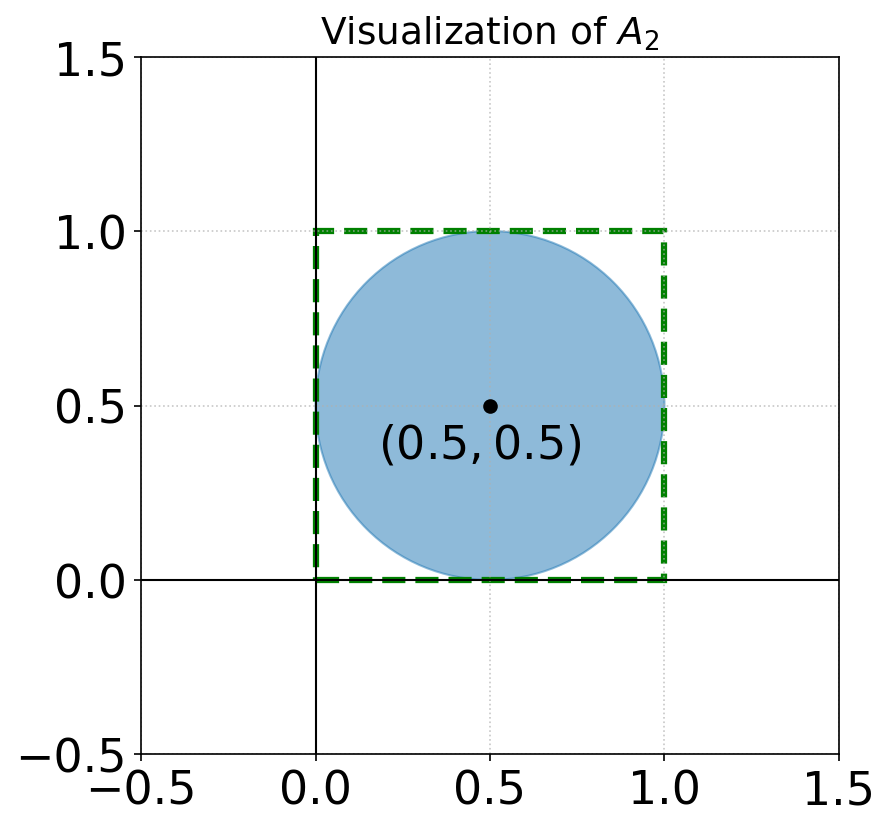
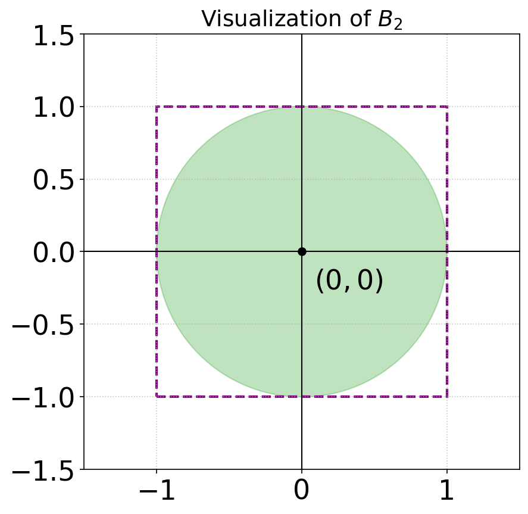
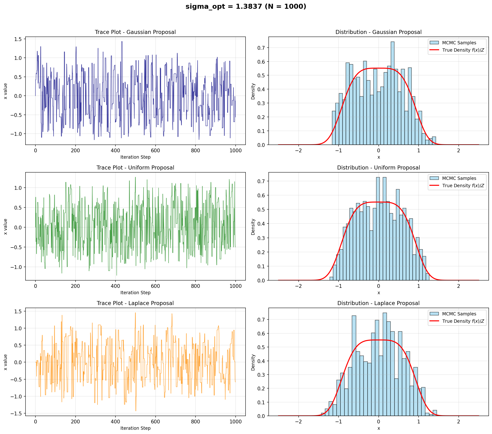
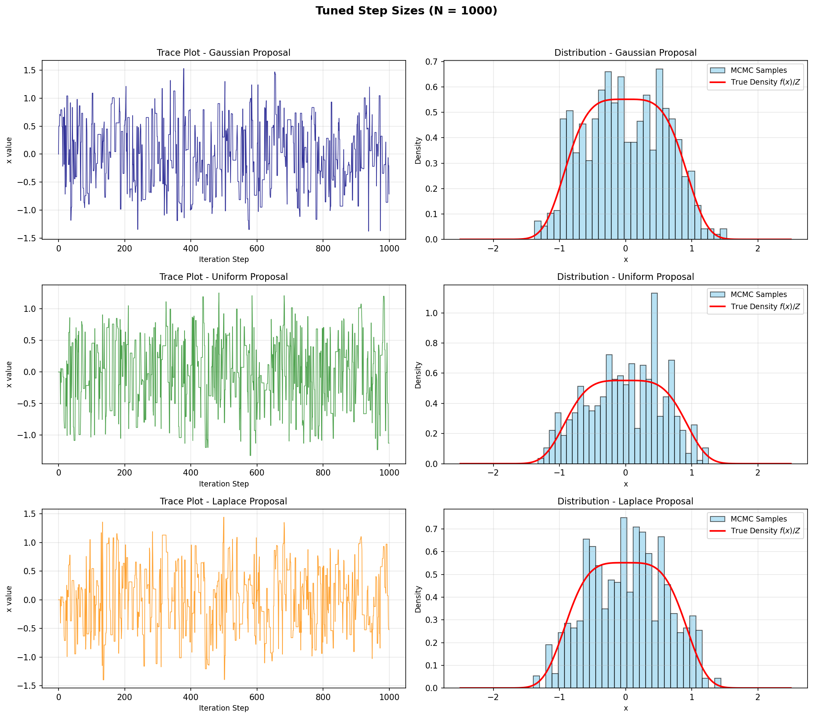

# MATH4010 Final Project — Group D

Advanced Probability & Statistics final project covering Monte Carlo volume estimation, Metropolis sampling, and audio entropy analysis.

## Question 1: Monte Carlo Volume Estimation

Estimate the volume of n-dimensional balls using hit-or-miss Monte Carlo.

### 1a. 2D Area Estimation (A₂, B₂)

| Shape | Ground Truth | Estimate | Rel Error | 95% CI |
|-------|-------------|----------|-----------|--------|
| A₂ | π/4 = 0.785398 | **0.785432** | **0.0044%** | [0.785178, 0.785687] |
| B₂ | π = 3.141593 | **3.141413** | **0.0057%** | [3.140395, 3.142431] |

<p float="left">
  
  
</p>

N = 10⁷ samples. Both estimates achieve relative errors below 0.01%.

### 1b. 3D Volume Estimation (A₃, B₃)

| Shape | Ground Truth | Estimate | Rel Error | 95% CI |
|-------|-------------|----------|-----------|--------|
| A₃ | π/6 = 0.523599 | **0.523333** | **0.0508%** | [0.523023, 0.523642] |
| B₃ | 4π/3 = 4.188790 | **4.187672** | **0.0267%** | [4.185196, 4.190148] |

N = 10⁷ samples. Relative errors below 0.06%. Convergence rate is O(1/√N) in both 2D and 3D, but the constant factor grows with dimension due to lower hit probability and larger bounding boxes.

### 1c. 100D Volume Estimation (A₁₀₀, B₁₀₀)

Exact volumes:
- V(A₁₀₀) = π⁵⁰/Γ(51) · (1/2)¹⁰⁰ ≈ 1.868 × 10⁻⁷⁰
- V(B₁₀₀) = π⁵⁰/Γ(51) ≈ 2.368 × 10⁻⁴⁰

| Method | A₁₀₀ Estimate | A₁₀₀ Rel Err | B₁₀₀ Estimate | B₁₀₀ Rel Err |
|--------|---------------|--------------|---------------|--------------|
| Naive MC | 0 (M=0) | 100% | 0 (M=0) | 100% |
| Stratified (LHS) | 0 (M=0) | 100% | 0 (M=0) | 100% |
| Antithetic | 0 (M=0) | 100% | 0 (M=0) | 100% |
| Importance Sampling | **1.867 × 10⁻⁷⁰** | **0.08%** | **2.367 × 10⁻⁴⁰** | **0.03%** |

Naive MC and variance reduction methods all produce zero hits at n=100 because the hit probability is ~10⁻⁷⁰. Gaussian importance sampling with σ = R/√n succeeds by matching the thin-shell geometry, achieving sub-0.1% relative error.

---

## Question 2: Metropolis Algorithm

Target distribution: f(x) = (1/Z) e⁻ˣ⁴, with Z = Γ(1/4)/2 ≈ 1.8128, E[X] = 0, Var(X) = Γ(3/4)/Γ(1/4) ≈ 0.3380.

Three symmetric proposals (Gaussian, Uniform, Laplace) with optimal scaling σ_opt = 2.38 · σ_target ≈ 1.38.

### Initial results (σ_opt = 1.38 for all)

| Proposal | Acceptance Rate | Sample Mean | Sample Variance |
|----------|----------------|-------------|-----------------|
| Gaussian | **48.15%** | -0.0213 | 0.3745 |
| Uniform | 63.06% | 0.0276 | 0.3249 |
| Laplace | **43.94%** | 0.0168 | 0.3455 |
| Theoretical | ~44% | 0.0000 | 0.3380 |



### Tuned results (per-proposal optimized step sizes)

| Proposal | Step Size | Acceptance Rate | Sample Mean | Sample Variance |
|----------|-----------|----------------|-------------|-----------------|
| Gaussian | 1.6466 | **44.04%** | -0.0086 | 0.3748 |
| Uniform | 1.9716 | 46.05% | -0.0049 | 0.3298 |
| Laplace | 1.3581 | **44.04%** | 0.0218 | 0.3440 |
| Theoretical | — | ~44% | 0.0000 | 0.3380 |



After per-proposal step size tuning, all proposals achieve acceptance rates near the theoretical optimum of 44%.

---

## Question 3: Audio Entropy Analysis

10 ambient noise clips and 10 music clips (4s, 16 kHz mono). Bin width via Freedman-Diaconis rule (Δ ≈ 0.000281, K = 7122 bins).

### Raw results (summary)

| Class | Mean H_Q | Mean Ĥ | Mean Gap | Mean W |
|-------|----------|--------|----------|--------|
| Ambient | 7.039 | -4.759 | **0.023** | **0.991** |
| Music | 8.092 | -3.706 | 0.105 | 0.966 |

### Normalized results (peak-normalized to [-1, 1], summary)

| Class | Mean H_Q | Mean Ĥ | Mean Gap | Mean W |
|-------|----------|--------|----------|--------|
| Ambient | 7.773 | -0.309 | **0.050** | **0.991** |
| Music | 7.257 | -0.824 | 0.099 | 0.966 |

Ambient noise has a smaller entropy gap (closer to Gaussian), consistent with the central limit theorem — ambient sound is a superposition of many weakly dependent sources. Music has larger gaps due to its harmonic and temporal structure.

---

## Reproducibility

```bash
pip install -r requirements.txt
```

Run `Q1.ipynb`, `Q2.ipynb`, `Q3.ipynb` in order. Plots are saved to `1/`, `2/`, `3/`.

## References

- Agapiou et al. (2017). Importance sampling: Intrinsic dimension and computational cost. *Statistical Science*.
- Cover & Thomas (2006). *Elements of Information Theory*. Wiley.
- Gelman et al. (1996). Efficient Metropolis jumping rules. *Bayesian Statistics 5*.
- Roberts et al. (1997). Weak convergence and optimal scaling of random walk Metropolis algorithms. *Annals of Applied Probability*.
- Vershynin (2018). *High-Dimensional Probability*. Cambridge University Press.
